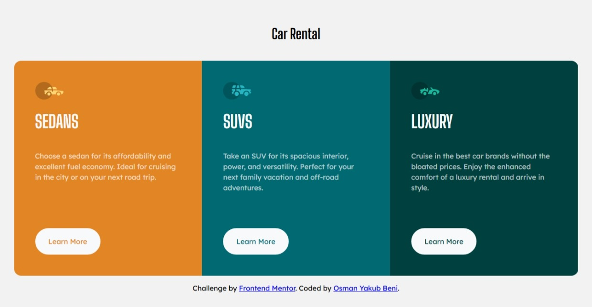

# Frontend Mentor - 3-column preview card component solution

This is my solution to the [3-column preview card component challenge](https://www.frontendmentor.io/challenges/3column-preview-card-component-pH92eAR2-) from Frontend Mentor.

## Overview

### The challenge

Users should be able to:

- View the optimal layout depending on their device's screen size
- See hover states for interactive elements

### Screenshot

### Links

- Solution URL: Not available yet
- Live Site URL: Not available yet

## My process

### Built with

- Semantic HTML5
- CSS custom properties
- CSS Grid
- Flexbox
- CSS Container Queries
- CSS View Transitions
- Open Props
- Mobile-first responsive design

### What I learned

This project gave me the opportunity to explore several modern CSS features more deeply.

One of the main things I learned was how to use **CSS Subgrid**. I also learned that a container query's queryable dimension can effectively be `0` if the relevant container size isn't explicitly established.

I also learned more about organizing CSS. When a module needs different styles for different scenarios, I found that keeping those styles close to the module makes the code easier to understand and maintain.

One small thing I'm particularly proud of is using JavaScript's `history.back()` method to reproduce the browser's back-navigation behavior. Although it is a small feature, figuring it out and getting it working was one of the things that made me happiest about the project.

### Continued development

I want to continue improving my CSS skills, particularly writing CSS that is clean, maintainable, and easier to understand.

I also want to explore more modern CSS features and learn not only how they work, but when they are useful in real projects.

### Useful resources

- [ChatGPT](https://chatgpt.com/) - Used as a learning and problem-solving resource while working through the project.
- [Frontend Mentor](https://www.frontendmentor.io/) - Provided the challenge and design requirements.

## Author

- Name: Osman Yakub Beni

## Acknowledgments

Thanks to ChatGPT for helping me work through questions and understand some of the concepts I encountered while building this project.
